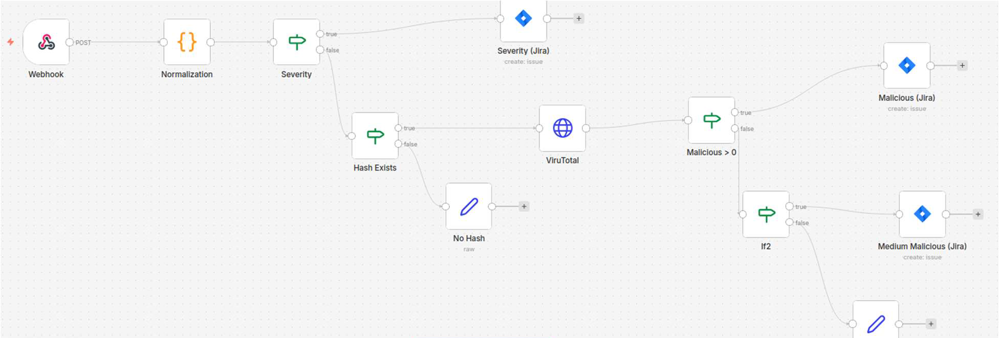
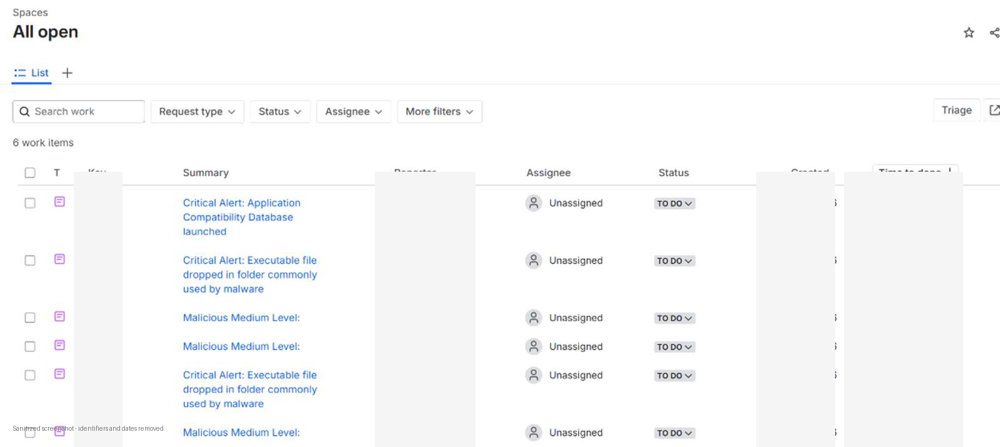

# SIEM + SOAR Security Operations Automation Lab


## Executive summary

This repository documents a hands-on blue-team lab that integrates **Wazuh**, **n8n**, **VirusTotal**, and **Jira** into a lightweight SIEM + SOAR workflow.

The goal of the project is to reduce repetitive analyst triage by automatically collecting endpoint security events, normalizing alert data, enriching file-hash indicators with threat intelligence, and creating prioritized Jira tickets for events that require investigation.

This repository is written as a professional project portfolio. It contains sanitized diagrams, screenshots, sample alerts, workflow logic, testing notes, limitations, and future engineering improvements. No credentials, private client data, institutional identifiers, or private source material are included.

## What this project demonstrates

- SIEM alert collection and endpoint telemetry analysis using Wazuh.
- SOAR-style workflow orchestration using n8n webhooks and decision nodes.
- JSON normalization for consistent alert handling.
- Threat-intelligence enrichment using VirusTotal API logic.
- Incident ticket generation in Jira for high-priority detections.
- Controlled validation using Atomic Red Team techniques.
- Practical trade-off analysis around scalability, API limits, false positives, privacy, and third-party dependency risks.

## Problem statement

Small security teams often receive more alerts than they can manually triage. Repetitive tasks such as checking alert severity, extracting hashes, querying threat-intelligence sources, and creating incident tickets consume analyst time and increase response delay.

This project addresses that problem by building an automation layer between the SIEM and the ticketing platform:

```text
Endpoint telemetry -> Wazuh alert -> n8n workflow -> enrichment/decision logic -> Jira ticket
```

The intent is not to replace analysts. The intent is to remove repetitive enrichment and routing work so analysts can focus on higher-value investigation.

## Technology stack

| Area | Tool | Purpose |
|---|---|---|
| SIEM | Wazuh | Collect endpoint telemetry, analyze events, and generate alerts |
| Endpoint telemetry | Sysmon / Windows event logs | Provide process, file, and host activity context |
| SOAR workflow | n8n | Receive alerts, normalize JSON, route decisions, and call APIs |
| Threat intelligence | VirusTotal API | Enrich file hashes and identify malicious indicators |
| Ticketing | Jira | Generate incident tickets for analyst review |
| Testing | Atomic Red Team | Produce controlled security events for validation |
| Infrastructure | Virtual machines / Docker | Host lab components in a reproducible local environment |

## Architecture

The lab follows a simple event-driven architecture:

1. A Windows endpoint generates security telemetry.
2. Wazuh collects and analyzes the telemetry.
3. Wazuh sends alert data to an n8n webhook as JSON.
4. n8n normalizes the alert into consistent fields.
5. Decision logic checks severity and file-hash context.
6. VirusTotal is queried when enrichment is required.
7. Jira tickets are created only for alerts that meet escalation criteria.


## Automation logic

The workflow uses a tiered decision model:

```text
Receive alert
  -> Normalize JSON fields
  -> If severity is high: create Jira ticket
  -> Else if hash exists: query VirusTotal
  -> If VirusTotal returns malicious signal: create Jira ticket
  -> Else: suppress, monitor, or document as low priority
```

The normalized fields include:

- Timestamp
- Hostname
- Severity
- Rule ID
- Rule description
- Event type
- Username
- Process image
- File path
- SHA256 hash
- Threat-intelligence verdict

## Screenshots

### n8n workflow

The n8n workflow receives Wazuh alerts, normalizes the incoming payload, applies severity and hash checks, performs threat enrichment, then routes malicious or high-severity alerts into Jira.



### Jira queue

The Jira queue shows automatically generated incident tickets from the workflow. Identifiers, reporter names, dates, and queue metadata have been removed from the screenshot.



## Validation

The lab was validated using controlled test scenarios:

| Test scenario | Expected result | Outcome |
|---|---|---|
| High-severity Wazuh alert | Jira ticket created immediately | Passed |
| Alert with file hash | VirusTotal enrichment performed | Passed |
| Malicious enrichment result | Jira ticket created with malicious context | Passed |
| Low-priority alert | Event filtered or suppressed | Passed |
| No hash available | Enrichment branch skipped | Passed |


## Key design decisions

### Why Wazuh?

Wazuh was selected because it provides open-source SIEM-style monitoring, rule-based alerting, endpoint visibility, and integration flexibility without requiring an enterprise license.

### Why n8n?

The automation layer originally required a workflow engine that could handle webhooks, branching logic, API calls, and ticket creation. n8n was selected because it provided more control for a self-hosted lab environment and avoided request-volume limitations encountered during earlier workflow prototyping.

### Why Jira?

Jira was used to model the way security alerts become trackable work items in a service-desk or incident-management queue.

### Why VirusTotal?

VirusTotal was used as an enrichment source to demonstrate how an analyst can add external reputation context to file-hash indicators before deciding whether an alert needs escalation.

## Limitations

This project is a lab prototype, not a production SOC deployment. Important limitations include:

- Alert thresholds require continuous tuning.
- VirusTotal API usage is subject to rate limits and third-party availability.
- Hardcoded decision logic can misclassify events if rule severity is poorly tuned.
- Scaling to many endpoints would require more robust infrastructure and queue handling.
- Production deployment would require strict privacy, access-control, and data-retention controls.
- Screenshots and sample data are sanitized and should not be treated as production evidence.

## Future improvements

Planned improvements include:

- Add retry queues and error handling for failed API calls.
- Add duplicate-ticket prevention using event fingerprinting.
- Add severity scoring that combines SIEM severity, threat-intelligence results, asset criticality, and user context.
- Add Slack, Microsoft Teams, or email notification paths.
- Add dashboards for triage volume, enrichment outcomes, and false-positive trends.
- Expand detection coverage using Sigma-style rule mapping.
- Rebuild the workflow using Microsoft Sentinel, Defender XDR, and Logic Apps for a Microsoft-focused version.
- Add infrastructure-as-code for repeatable deployment.

## Repository structure

```text
SOC-Automation-Lab/
├── README.md
├── docs/
│   ├── 01-architecture.md
│   ├── 02-detection-workflow.md
│   ├── 03-implementation.md
│   ├── 04-testing-and-validation.md
│   ├── 05-lessons-learned.md
│   ├── 06-risk-privacy-and-limitations.md
│   ├── 07-future-improvements.md
│   └── recruiter-summary.md
├── diagrams/
│   ├── architecture.svg
│   ├── workflow_logic.svg
│   └── testing_flow.svg
├── screenshots/
│   ├── n8n_workflow_sanitized.png
│   └── jira_ticket_queue_sanitized.png
├── sample-alerts/
│   ├── wazuh_alert_sample_sanitized.json
│   ├── normalized_alert_sample.json
│   └── jira_ticket_template.md
├── workflows/
│   ├── n8n_logic_pseudocode.md
│   └── workflow_schema_sanitized.json
├── .gitignore
├── LICENSE
└── SECURITY.md
```

## Interview talking point

A concise way to explain this project in an interview:

> I built a SIEM + SOAR lab that collected endpoint alerts through Wazuh, sent them to n8n through a webhook, normalized the JSON event data, enriched file hashes with VirusTotal, and automatically created Jira tickets for high-severity or malicious detections. The main engineering challenge was designing reliable decision logic while managing noise, API limitations, and workflow scalability.

## Disclaimer

This repository contains sanitized lab documentation and sample data only. It does not include production data, private client data, API keys, credentials, institutional information, or private source material.
