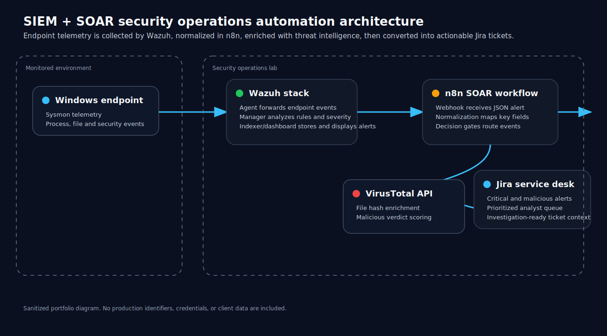

# Architecture

## Overview

This project implements a lightweight SIEM + SOAR architecture for security alert triage automation.

The design connects endpoint telemetry, SIEM alerting, workflow automation, threat-intelligence enrichment, and ticket creation into one pipeline.

```text
Windows endpoint
  -> Sysmon / Windows event logs
  -> Wazuh agent
  -> Wazuh manager
  -> n8n webhook
  -> Normalization and decision logic
  -> VirusTotal enrichment
  -> Jira incident ticket
```



## Core components

### Windows endpoint

The endpoint represents a monitored workstation. It produces host-level telemetry such as process creation, file creation, and other Windows security events.

### Wazuh agent

The Wazuh agent forwards endpoint telemetry to the Wazuh manager for analysis.

### Wazuh manager

The Wazuh manager applies detection rules, assigns severity, and emits alerts when security-relevant events are identified.

### n8n workflow engine

n8n acts as the automation layer. It receives Wazuh alerts through a webhook, normalizes the alert structure, applies branching logic, calls external APIs, and sends output to Jira.

### VirusTotal

VirusTotal is used as a threat-intelligence enrichment source for file hashes. The workflow only calls VirusTotal when a hash exists and additional context is required.

### Jira

Jira receives escalated alerts as tickets. This gives analysts a queue of actionable incidents rather than a raw stream of SIEM events.

## Data flow

1. Endpoint telemetry is generated.
2. Wazuh evaluates the event.
3. Wazuh sends alert JSON to the n8n webhook.
4. n8n extracts the fields required for triage.
5. Severity and hash-based checks determine the next action.
6. VirusTotal enriches hash-based alerts.
7. Jira tickets are created for high-priority events.

## Design principle

The architecture is designed around one principle:

> Automate repetitive enrichment and routing, but keep human analysts responsible for final investigation and decision-making.

The system does not claim that an alert is confirmed compromise. It only prioritizes and enriches events so analysts can investigate faster.
