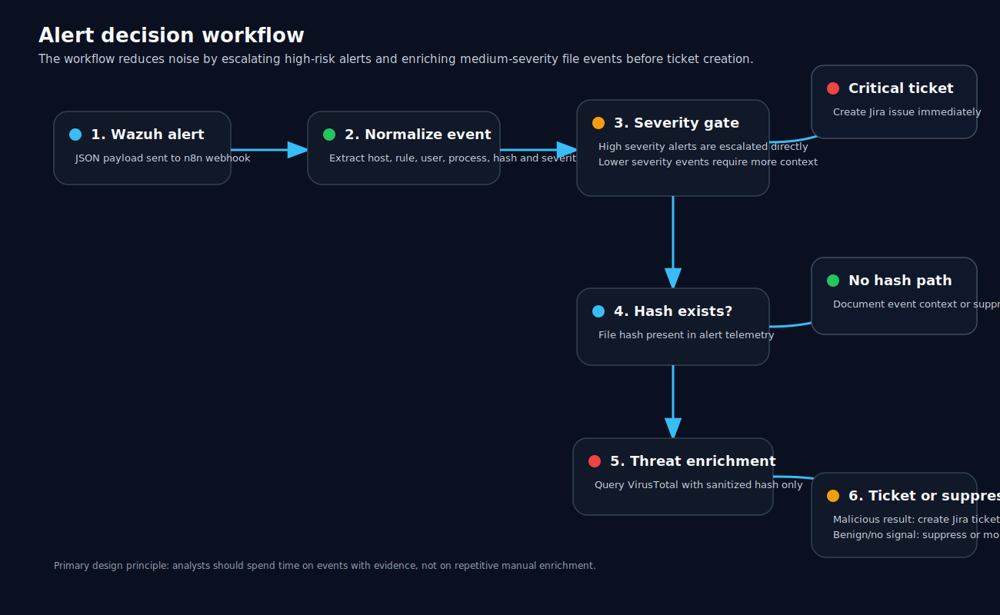

# Detection workflow

## Workflow summary

The workflow receives a Wazuh alert, normalizes it into a predictable schema, then applies severity and enrichment logic before creating a Jira ticket.



## Normalization fields

The workflow normalizes Wazuh alert JSON into a smaller triage object.

| Field | Purpose |
|---|---|
| `timestamp` | Time of event generation |
| `severity` | Wazuh rule level used for triage routing |
| `rule_id` | Wazuh rule identifier |
| `description` | Human-readable alert description |
| `hostname` | Endpoint that generated the event |
| `event_type` | Event category or rule group |
| `username` | User context when available |
| `process` | Process image path when available |
| `file_path` | Target file path when available |
| `sha256` | Extracted file hash when available |
| `threat_intel_verdict` | Enrichment result from VirusTotal |

## Decision logic

```text
START
  |
  v
Receive Wazuh alert through n8n webhook
  |
  v
Normalize JSON fields
  |
  v
Is severity high?
  |-- yes -> Create Jira ticket
  |
  no
  |
  v
Does the alert contain a hash?
  |-- no -> Suppress or document as low-priority context
  |
  yes
  |
  v
Query VirusTotal
  |
  v
Is malicious count greater than zero?
  |-- yes -> Create Jira ticket with enrichment details
  |
  no
  |
  v
Suppress, monitor, or leave for future correlation
```

## Why normalization matters

Raw alert data from SIEM tools is often nested, inconsistent, and difficult to use directly in automation logic. Normalization reduces the alert into fields that are stable enough for routing, enrichment, and ticket generation.

Without normalization, the workflow becomes fragile because every downstream node depends on the original nested structure of the SIEM alert.

## Ticket creation logic

A Jira ticket is generated when the alert meets at least one escalation condition:

- The alert severity is high.
- The alert contains a file hash and threat intelligence indicates malicious activity.
- The alert has enough context to justify human investigation.

## Suppression logic

An alert may be suppressed or skipped when:

- Severity is low.
- No file hash is available for enrichment.
- Threat intelligence does not return a malicious signal.
- The event lacks enough context for useful analyst action.

Suppression does not mean the event is harmless. It means the current workflow does not have enough signal to escalate it automatically.
