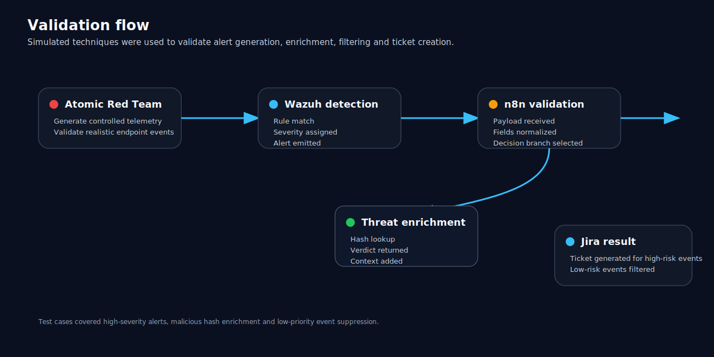

# Testing and validation

## Testing objective

Testing focused on verifying that the workflow could correctly process security events, enrich indicators, filter low-priority noise, and create tickets for alerts requiring analyst review.

## Test cases

| Test case | Input | Expected behavior | Result |
|---|---|---|---|
| High-severity alert | Wazuh alert with high rule level | Create Jira ticket without requiring enrichment | Passed |
| Hash-based alert | Alert containing file hash | Query VirusTotal for enrichment | Passed |
| Malicious hash result | VirusTotal malicious count greater than zero | Create Jira ticket with enrichment context | Passed |
| Low-priority alert | Low-severity event with limited context | Filter, suppress, or skip ticket creation | Passed |
| No hash available | Medium or low alert without file hash | Skip enrichment branch | Passed |

## Validation tools

Atomic Red Team was used to generate controlled security activity. This made it possible to validate whether endpoint telemetry appeared in Wazuh and whether the automation workflow responded as expected.

## Validation criteria

A workflow test was considered successful when:

- Wazuh generated an alert.
- n8n received the alert payload.
- Required fields were normalized correctly.
- The workflow selected the correct branch.
- VirusTotal enrichment ran only when required.
- Jira tickets were generated only for events that met escalation criteria.

## Testing lessons

The most important testing lesson was that workflow logic must be tuned continuously. A severity threshold that works in one environment may be too noisy or too quiet in another.

The workflow should therefore be treated as an iterative detection engineering process rather than a one-time static configuration.
